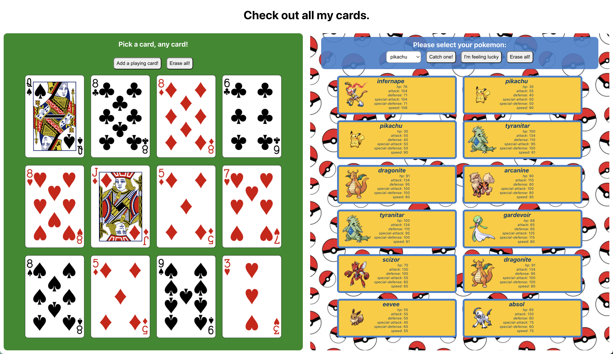

# Two applications where you draw cards:

## Built custom hooks and helpers according to these requirements:

### useFlip

Both the PokemonCard and the PlayingCard components can be flipped over when clicked on. You may have noticed that there is some duplicate code in these components. Create a hooks.js file in src/, and in that file write a custom hook called useFlip which will hold the business logic for flipping any type of card.

useFlip doesn’t need to take an argument, and similar to useState, it should return an array with two elements. The first element is the current flip state of the card, and the second element is a function that will toggle the flip state.

Once you’ve written this hook, refactor PokemonCard and PlayingCard to use this custom hook.

### useAxios in PlayingCardList

In the PlayingCardList component, we initialize an empty array in state, and add to it via an AJAX request we make with axios. Since we use axios in a few components, let’s move this logic into a function called useAxios.

useAxios should take in a URL, and similar to useState, it should return an array with two elements. The first element is an array of data obtained from previous AJAX requests (since we will add to this array, it’s a piece of state). The second element is a function that will add a new object of data to our array.

Once you’ve written this hook, refactor PlayingCardList to use this custom hook. (Don’t worry about PokeDex for now - that’s coming in the next part!

### useAxios in PokeDex

PokeDex also make AJAX requests, but this one’s a bit trickier. PlayingCardList makes a request to the same endpoint every time, but the endpoint in PokeDex depends on the name of the pokemon.

Figure out a way to modify your useAxios hook so that when you call useAxios you can just provide a base url, and when you want to add to your array of response data in state, you can provide the rest of the url.

Once you’ve done this, refactor PokeDex to use useAxios. Make sure PlayingCardList still works too!

Please let us see your code at this point!

### Removing response data

Add two buttons to the page: one that will erase all of the playing cards in state, and one that will erase all of the pokemon cards.

Since these arrays are controlled from within the useAxios hook, one way to approach this would be to have useAxios have a third element in its return array: a function that will remove everything from the array in state.

### Minimizing state

The original application threw all of the response data into state, even though we didn’t use all of it. For example, we only need an image url from the Deck of Cards API, and the Pokemon API gives us a ton of data we don’t need.

One way to avoid throwing all of this information in state is to pass a formatting function to useAxios. This function should take the response data and extract only the information we need to render our component.

Write two formatting functions - one for our playing card and one for our Pokemon card - and then refactor useAxios to accept a formatting function.

At the end of this process, our array in state for PlayingCardList should look like

[{ id, image }, ...] ,

and our array in state for PokeDex should look like

[{ id, front, back, name, stats: [{ name, value }, ...] }, ... ].

### useLocalStorage hook

If we sync our arrays of state data to local storage, we could persist our cards even after a page refresh. Let’s build a custom hook called useLocalStorage which works like useState, except it also syncs to local storage after every state change, and tries to read from local storage when the component renders.

useLocalStorage should accept two arguments. The first should be a key, corresponding to the key in local storage. The second should be an initial value to put into local storage (assuming no value already exists).

Once you have written this hook, refactor useAxios to use useLocalStorage instead of useState.
